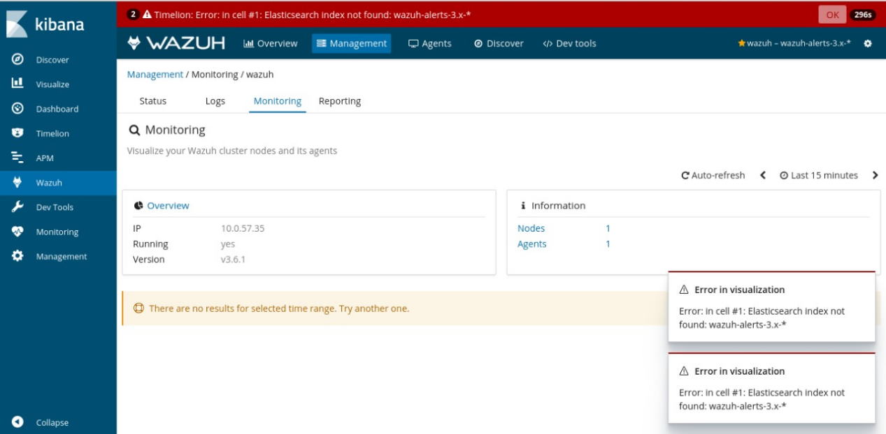
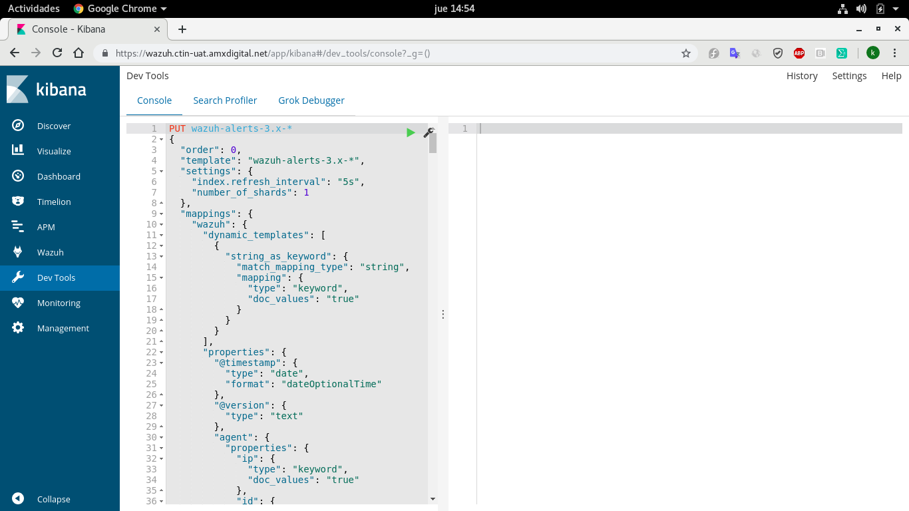
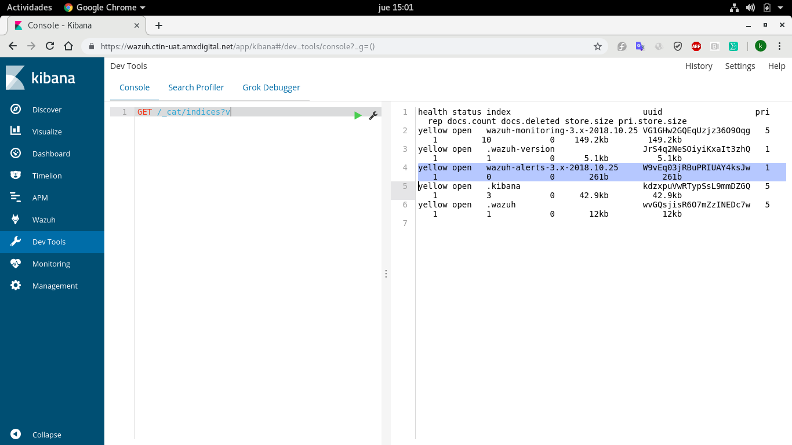

# Issues

## Error "Elasticsearch index not found: wazuh-alerts-3.x- wazuh"

Después de la instalación es posible que este error aparezca:



Este error se presenta cuando el index **wazuh-alerts-3.x-** nos es creado de manera automatica.

La solución se presenta ingresando lo siguiente, en el apartado **Dev Tools** del dashboard.

```json
PUT wazuh-alerts-3.x-*
{
  "order": 0,
  "template": "wazuh-alerts-3.x-*",
  "settings": {
    "index.refresh_interval": "5s",
    "number_of_shards": 1
  },
  "mappings": {
    "wazuh": {
      "dynamic_templates": [
        {
          "string_as_keyword": {
            "match_mapping_type": "string",
            "mapping": {
              "type": "keyword",
              "doc_values": "true"
            }
          }
        }
      ],
      "properties": {
        "@timestamp": {
          "type": "date",
          "format": "dateOptionalTime"
        },
        "@version": {
          "type": "text"
        },
        "agent": {
          "properties": {
            "ip": {
              "type": "keyword",
              "doc_values": "true"
            },
            "id": {
              "type": "keyword",
              "doc_values": "true"
            },
            "name": {
              "type": "keyword",
              "doc_values": "true"
            }
          }
        },
        "manager": {
          "properties": {
            "name": {
              "type": "keyword",
              "doc_values": "true"
            }
          }
        },
        "cluster": {
          "properties": {
            "name": {
              "type": "keyword",
              "doc_values": "true"
            }
          }
        },
        "AlertsFile": {
          "type": "keyword",
          "doc_values": "true"
        },
        "full_log": {
          "type": "text"
        },
        "previous_log": {
          "type": "text"
        },
        "GeoLocation": {
          "properties": {
            "area_code": {
              "type": "long"
            },
            "city_name": {
              "type": "keyword",
              "doc_values": "true"
            },
            "continent_code": {
              "type": "text"
            },
            "coordinates": {
              "type": "double"
            },
            "country_code2": {
              "type": "text"
            },
            "country_code3": {
              "type": "text"
            },
            "country_name": {
              "type": "keyword",
              "doc_values": "true"
            },
            "dma_code": {
              "type": "long"
            },
            "ip": {
              "type": "keyword",
              "doc_values": "true"
            },
            "latitude": {
              "type": "double"
            },
            "location": {
              "type": "geo_point"
            },
            "longitude": {
              "type": "double"
            },
            "postal_code": {
              "type": "keyword"
            },
            "real_region_name": {
              "type": "keyword",
              "doc_values": "true"
            },
            "region_name": {
              "type": "keyword",
              "doc_values": "true"
            },
            "timezone": {
              "type": "text"
            }
          }
        },
        "host": {
          "type": "keyword",
          "doc_values": "true"
        },
        "syscheck": {
          "properties": {
            "path": {
              "type": "keyword",
              "doc_values": "true"
            },
            "sha1_before": {
              "type": "keyword",
              "doc_values": "true"
            },
            "sha1_after": {
              "type": "keyword",
              "doc_values": "true"
            },
            "uid_before": {
              "type": "keyword",
              "doc_values": "true"
            },
            "uid_after": {
              "type": "keyword",
              "doc_values": "true"
            },
            "gid_before": {
              "type": "keyword",
              "doc_values": "true"
            },
            "gid_after": {
              "type": "keyword",
              "doc_values": "true"
            },
            "perm_before": {
              "type": "keyword",
              "doc_values": "true"
            },
            "perm_after": {
              "type": "keyword",
              "doc_values": "true"
            },
            "md5_after": {
              "type": "keyword",
              "doc_values": "true"
            },
            "md5_before": {
              "type": "keyword",
              "doc_values": "true"
            },
            "gname_after": {
              "type": "keyword",
              "doc_values": "true"
            },
            "gname_before": {
              "type": "keyword",
              "doc_values": "true"
            },
            "inode_after": {
              "type": "keyword",
              "doc_values": "true"
            },
            "inode_before": {
              "type": "keyword",
              "doc_values": "true"
            },
            "mtime_after": {
              "type": "date",
              "format": "dateOptionalTime",
              "doc_values": "true"
            },
            "mtime_before": {
              "type": "date",
              "format": "dateOptionalTime",
              "doc_values": "true"
            },
            "uname_after": {
              "type": "keyword",
              "doc_values": "true"
            },
            "uname_before": {
              "type": "keyword",
              "doc_values": "true"
            },
            "size_before": {
              "type": "long",
              "doc_values": "true"
            },
            "size_after": {
              "type": "long",
              "doc_values": "true"
            },
            "diff": {
              "type": "keyword",
              "doc_values": "true"
            },
            "event": {
              "type": "keyword",
              "doc_values": "true"
            }
          }
        },
        "location": {
          "type": "keyword",
          "doc_values": "true"
        },
        "message": {
          "type": "text"
        },
        "offset": {
          "type": "keyword"
        },
        "rule": {
          "properties": {
            "description": {
              "type": "keyword",
              "doc_values": "true"
            },
            "groups": {
              "type": "keyword",
              "doc_values": "true"
            },
            "level": {
              "type": "long",
              "doc_values": "true"
            },
            "id": {
              "type": "keyword",
              "doc_values": "true"
            },
            "cve": {
              "type": "keyword",
              "doc_values": "true"
            },
            "info": {
              "type": "keyword",
              "doc_values": "true"
            },
            "frequency": {
              "type": "long",
              "doc_values": "true"
            },
            "firedtimes": {
              "type": "long",
              "doc_values": "true"
            },
            "cis": {
              "type": "keyword",
              "doc_values": "true"
            },
            "pci_dss": {
              "type": "keyword",
              "doc_values": "true"
            },
            "gdpr": {
              "type": "keyword",
              "doc_values": "true"
            },
            "gpg13": {
              "type": "keyword",
              "doc_values": "true"
            }
          }
        },
        "decoder": {
          "properties": {
            "parent": {
              "type": "keyword",
              "doc_values": "true"
            },
            "name": {
              "type": "keyword",
              "doc_values": "true"
            },
            "ftscomment": {
              "type": "keyword",
              "doc_values": "true"
            },
            "fts": {
              "type": "long",
              "doc_values": "true"
            },
            "accumulate": {
              "type": "long",
              "doc_values": "true"
            }
          }
        },
        "data": {
          "properties": {
            "protocol": {
              "type": "keyword",
              "doc_values": "true"
            },
            "action": {
              "type": "keyword",
              "doc_values": "true"
            },
            "srcip": {
              "type": "keyword",
              "doc_values": "true"
            },
            "dstip": {
              "type": "keyword",
              "doc_values": "true"
            },
            "srcport": {
              "type": "keyword",
              "doc_values": "true"
            },
            "dstport": {
              "type": "keyword",
              "doc_values": "true"
            },
            "srcuser": {
              "type": "keyword",
              "doc_values": "true"
            },
            "dstuser": {
              "type": "keyword",
              "doc_values": "true"
            },
            "id": {
              "type": "keyword",
              "doc_values": "true"
            },
            "status": {
              "type": "keyword",
              "doc_values": "true"
            },
            "data": {
              "type": "keyword",
              "doc_values": "true"
            },
            "system_name": {
              "type": "keyword",
              "doc_values": "true"
            },
            "url": {
              "type": "keyword",
              "doc_values": "true"
            },
            "oscap": {
              "properties": {
                "check.title": {
                  "type": "keyword",
                  "doc_values": "true"
                },
                "check.id": {
                  "type": "keyword",
                  "doc_values": "true"
                },
                "check.result": {
                  "type": "keyword",
                  "doc_values": "true"
                },
                "check.severity": {
                  "type": "keyword",
                  "doc_values": "true"
                },
                "check.description": {
                  "type": "text"
                },
                "check.rationale": {
                  "type": "text"
                },
                "check.references": {
                  "type": "text"
                },
                "check.identifiers": {
                  "type": "text"
                },
                "check.oval.id": {
                  "type": "keyword",
                  "doc_values": "true"
                },
                "scan.id": {
                  "type": "keyword",
                  "doc_values": "true"
                },
                "scan.content": {
                  "type": "keyword",
                  "doc_values": "true"
                },
                "scan.benchmark.id": {
                  "type": "keyword",
                  "doc_values": "true"
                },
                "scan.profile.title": {
                  "type": "keyword",
                  "doc_values": "true"
                },
                "scan.profile.id": {
                  "type": "keyword",
                  "doc_values": "true"
                },
                "scan.score": {
                  "type": "double",
                  "doc_values": "true"
                },
                "scan.return_code": {
                  "type": "long",
                  "doc_values": "true"
                }
              }
            },
            "audit": {
              "properties": {
                "type": {
                  "type": "keyword",
                  "doc_values": "true"
                },
                "id": {
                  "type": "keyword",
                  "doc_values": "true"
                },
                "syscall": {
                  "type": "keyword",
                  "doc_values": "true"
                },
                "exit": {
                  "type": "keyword",
                  "doc_values": "true"
                },
                "ppid": {
                  "type": "keyword",
                  "doc_values": "true"
                },
                "pid": {
                  "type": "keyword",
                  "doc_values": "true"
                },
                "auid": {
                  "type": "keyword",
                  "doc_values": "true"
                },
                "uid": {
                  "type": "keyword",
                  "doc_values": "true"
                },
                "gid": {
                  "type": "keyword",
                  "doc_values": "true"
                },
                "euid": {
                  "type": "keyword",
                  "doc_values": "true"
                },
                "suid": {
                  "type": "keyword",
                  "doc_values": "true"
                },
                "fsuid": {
                  "type": "keyword",
                  "doc_values": "true"
                },
                "egid": {
                  "type": "keyword",
                  "doc_values": "true"
                },
                "sgid": {
                  "type": "keyword",
                  "doc_values": "true"
                },
                "fsgid": {
                  "type": "keyword",
                  "doc_values": "true"
                },
                "tty": {
                  "type": "keyword",
                  "doc_values": "true"
                },
                "session": {
                  "type": "keyword",
                  "doc_values": "true"
                },
                "command": {
                  "type": "keyword",
                  "doc_values": "true"
                },
                "exe": {
                  "type": "keyword",
                  "doc_values": "true"
                },
                "key": {
                  "type": "keyword",
                  "doc_values": "true"
                },
                "cwd": {
                  "type": "keyword",
                  "doc_values": "true"
                },
                "directory.name": {
                  "type": "keyword",
                  "doc_values": "true"
                },
                "directory.inode": {
                  "type": "keyword",
                  "doc_values": "true"
                },
                "directory.mode": {
                  "type": "keyword",
                  "doc_values": "true"
                },
                "file.name": {
                  "type": "keyword",
                  "doc_values": "true"
                },
                "file.inode": {
                  "type": "keyword",
                  "doc_values": "true"
                },
                "file.mode": {
                  "type": "keyword",
                  "doc_values": "true"
                },
                "acct": {
                  "type": "keyword",
                  "doc_values": "true"
                },
                "dev": {
                  "type": "keyword",
                  "doc_values": "true"
                },
                "enforcing": {
                  "type": "keyword",
                  "doc_values": "true"
                },
                "list": {
                  "type": "keyword",
                  "doc_values": "true"
                },
                "old-auid": {
                  "type": "keyword",
                  "doc_values": "true"
                },
                "old-ses": {
                  "type": "keyword",
                  "doc_values": "true"
                },
                "old_enforcing": {
                  "type": "keyword",
                  "doc_values": "true"
                },
                "old_prom": {
                  "type": "keyword",
                  "doc_values": "true"
                },
                "op": {
                  "type": "keyword",
                  "doc_values": "true"
                },
                "prom": {
                  "type": "keyword",
                  "doc_values": "true"
                },
                "res": {
                  "type": "keyword",
                  "doc_values": "true"
                },
                "srcip": {
                  "type": "keyword",
                  "doc_values": "true"
                },
                "subj": {
                  "type": "keyword",
                  "doc_values": "true"
                },
                "success": {
                  "type": "keyword",
                  "doc_values": "true"
                }
              }
            },
            "aws": {
              "properties": {
                "bytes": {
                  "type": "long",
                  "doc_values": "true"
                },
                "dstaddr": {
                  "type": "ip",
                  "doc_values": "true"
                },
                "srcaddr": {
                  "type": "ip",
                  "doc_values": "true"
                },
                "end": {
                  "type": "date",
                  "doc_values": "true"
                },
                "start": {
                  "type": "date",
                  "doc_values": "true"
                },
                "source_ip_address": {
                  "type": "ip",
                  "doc_values": "true"
                },
                "resource.instanceDetails.networkInterfaces": {
                  "properties": {
                    "privateIpAddress": {
                      "type": "ip",
                      "doc_values": "true"
                    },
                    "publicIp": {
                      "type": "ip",
                      "doc_values": "true"
                    }
                  }
                },
                "service": {
                  "properties": {
                    "count": {
                      "type": "long",
                      "doc_values": "true"
                    },
                    "action.networkConnectionAction.remoteIpDetails": {
                      "properties": {
                        "ipAddressV4": {
                          "type": "ip",
                          "doc_values": "true"
                        },
                        "geoLocation": {
                          "properties": {
                            "lat": {
                              "type": "geo_point",
                              "doc_values": "true"
                            },
                            "lon": {
                              "type": "geo_point",
                              "doc_values": "true"
                            }
                          }
                        }
                      }
                    }
                  }
                }
              }
            }
          }
        },
        "program_name": {
          "type": "keyword",
          "doc_values": "true"
        },
        "command": {
          "type": "keyword",
          "doc_values": "true"
        },
        "type": {
          "type": "text"
        },
        "title": {
          "type": "keyword",
          "doc_values": "true"
        }
      }
    }
  }
}
```
Donde tendremos que modificar las siguientes lineas:

* __PUT wazuh-alerts-3.x-*__: Donde sustituiremos el **\*** por la fecha actual inciando por el año, separando dias, mes y año por un punto. Ejemplo **wazuh-alerts-3.x-2018.10.25**.

* __"template": "wazuh-alerts-3.x-*"__: Donde sustituiremos el **\*** por la fecha actual inciando por el año, separando dias, mes y año por un punto. Ejemplo **wazuh-alerts-3.x-2018.10.25**.

Situando el cursor en la primera linea damos play (triángulo verde)



Para verificar que el inidice fue creado, ejecutamos en esa misma consola el comando:

```bash
GET /_cat/indices?v
```



# Agentes de agrupación

Hay dos métodos para configurar los agentes registrados. Se pueden configurar localmente con el archivo ossec.conf o de forma remota utilizando la configuración centralizada . Si se utiliza la configuración centralizada, los agentes pueden asignarse a grupos, y cada grupo posee una configuración única. Esto simplifica enormemente el proceso de configuración general.
A menos que se asigne lo contrario, todos los agentes nuevos pertenecen automáticamente al grupo "predeterminado" .
 Este grupo se crea durante el proceso de instalación con los archivos de configuración ubicados en la etc/shared/default/ carpeta.
Estos archivos se enviarán desde el administrador a todos los agentes que pertenecen a este grupo.
A continuación se muestran los pasos para asignar agentes a un grupo con una configuración específica:
Una vez que se haya agregado un agente al administrador, asignarlo a un grupo utilizando la herramienta agent_groupso la API . A continuación, se muestran ejemplos de cómo asignar un agente con ID 002 al grupo 'nombre del grupo' usando estos métodos:
Utilizando agent_groups :
     var/ossec/bin/agent_groups -a -i 002 -g nombre del grupo
La asignación de grupo de un agente se puede verificar usando uno de los siguientes comandos:
Utilizando agent_groups :
/var/ossec/bin/agent_groups -l -g nombredelgrupo


Una vez que se crea un grupo, su agents.conf archivo se puede editar para incluir la configuración específica que desea asignar a este grupo. Para este ejemplo, el archivo que se editará se encuentra en etc/shared/dbms/agents.conf y cada agente que pertenece a este grupo recibirá este archivo.

# NOTA: 
Puede darse el caso de que no se  cree el directorio ni el archivo de configuracion del grupo, por lo cual se tiene que crear de forma manual dentro del directorio “etc”.
Los agentes se pueden configurar de forma remota mediante el agent.conf archivo. Las siguientes capacidades se pueden configurar de forma remota:
La sintaxis correcta de agent.conf se muestra a continuación junto con el proceso para enviar la configuración del administrador al agente.
agent.conf
configuracion xml
<agent_config>
    ...
</agent_config>


El agent.conf solo es válido en las instalaciones del servidor.
La agent.conf pueden existir en cada carpeta en el grupo /var/ossec/etc/shared.
creación de archivo:

### Paso 1:Crear el archivo y todos los directorios como shared, directorio con nombre del grupo
touch /var/ossec/etc/shared/default/agent.conf
<agent_config name = "agent_name" > 
    <localfile> 
        <location> /var/log/my.log </location> 
        <log_format> syslog </log_format> 
    </localfile> 
</agent_config>

<agent_config os = "Linux" > 
    <localfile> 
        <location> /var/log/linux.log </location> 
        <log_format> syslog </log_format> 
    </localfile> 
</agent_config>

<agent_config profile = "database" > 
    <localfile> 
        <location> /var/log/database.log </location> 
        <log_format> syslog </log_format> 
    </localfile> 
</agent_config>

### Paso 2: Cambia la propiedad
chown ossec: ossec /var/ossec/etc/shared/default/agent.conf
###  Paso 3: Se le dan permisos de lectura,  escritura y ejecución al archivo
chmod 640 /var/ossec/etc/shared/default/agent.conf

### Paso 4: Ejecute   ---- >    / var / ossec / bin / verify-agent-conf
Cada vez que realice un cambio en el agent.conf archivo, es importante verificar los errores de configuración.
### Paso 5: Confirme que el agente recibió la configuración.
Una vez que un agente recibe la configuración, el campo "Versión del cliente" tendrá la suma md5 del agent.confarchivo que se extrajo del administrador.
-----> md5sum /var/ossec/etc/shared/default/agent.conf
----->  /var/ossec/bin/agent_control -i 1032
### Paso 6: Reiniciar el agente
-----> /var/ossec/bin/agent_control -R -u 1032
De esta manera se a creado el archivo correctamente y ya se pueden administrar.
Administrar grupos de agentes:
Asigne el grupo 'debian' al agente 002:
---->  /var/ossec/bin/agent_groups -a -i 002 -g debian
Obtener el grupo de agente 002:
---->  /var/ossec/bin/agent_groups -s -i 002
Listar todos los agentes en el grupo 'debian' :
----> /var/ossec/bin/agent_groups -l -g debian
Lista los archivos de configuración en el grupo 'debian' :
----> /var/ossec/bin/agent_groups -c -g debian
Elimine el agente 002 del grupo actual:
---->  /var/ossec/bin/agent_groups -r -i 002
Elimine el grupo 'debian' de cada agente:
---->  /var/ossec/bin/agent_groups -r -g debian

